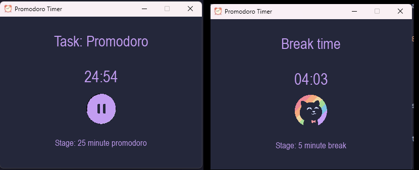

# Promodoro

A Promodoro Timer desktop application built in Python, using PyGame to create interactive UI elements.

## To-Do:

09-10-23
- [ ] Add a skip button
- [ ] Debug: Exiting application sometimes skips to break and doesn't change state from pause to play.
- [ ] Replace snippet with GIF

## Optimizations
- [ ] Conference with UI artist to discuss how to achieve button press effect with shadows.
- [ ] Update main.py so there is no delay on button press

## Screenshots

