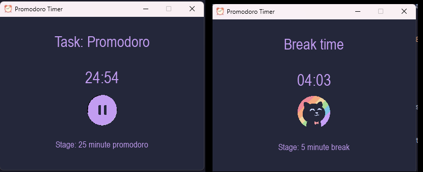

  

  
  
  
  
  

A Promodoro Timer desktop application built in Python, using PyGame to create interactive UI elements.

## Optimizations
- [ ] Conference with UI artist to discuss how to achieve button press effect with shadows.
- [ ] Update main.py so there is no delay on button press

## Screenshots

